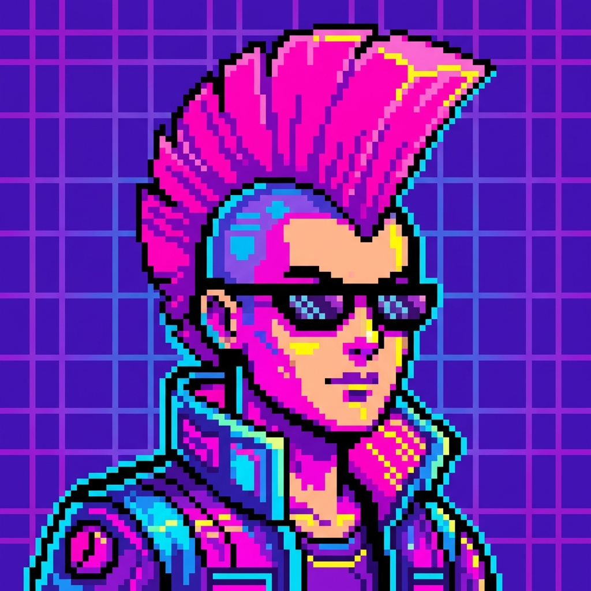

# 🎨 DrawChain

DrawChain is a real-time multiplayer drawing and guessing game built with **Next.js**, **Socket.io**, and **TailwindCSS**. Gather your friends, create a room, and let the creativity (and chaos) flow!

 *Note: Add a screenshot of your game here*

## ✨ Features

- **Real-Time Multiplayer**: Instant drawing synchronization across all clients using Socket.io.
- **Lobby System**: Create private rooms or join existing ones with a Room ID.
- **Game Logic**:
    - Turn-based drawing system.
    - Word selection for the drawer.
    - Timer-based rounds.
    - Real-time scoring and leaderboards.
- **Tools**:
    - ✏️ **Pencil**: Standard drawing tool.
    - 🧼 **Eraser**: Fix mistakes easily.
    - 🪣 **Fill Bucket**: Fill enclosed areas with color.
    - ↩️ **Undo/Redo**: Full history support to step back and forth.
    - 🗑️ **Clear**: Wipe the canvas.
    - 🎨 **Color Palette**: Vibrant selection of colors.
- **Mobile Responsive**: Optimized UI for both desktop and mobile devices.
- **Fun Aesthetics**: "Sketchy" hand-drawn design style.

## 🛠️ Tech Stack

- **Frontend**: [Next.js](https://nextjs.org/) (React), [TailwindCSS](https://tailwindcss.com/)
- **Backend**: [Node.js](https://nodejs.org/) (Custom Server), [Socket.io](https://socket.io/)
- **Language**: TypeScript

## 🚀 Getting Started

Follow these steps to run the project locally.

### Prerequisites

- Node.js (v18 or higher)
- npm or yarn

### Installation

1.  **Clone the repository**:
    ```bash
    git clone https://github.com/PankajKumar-11/DrawChain-.git
    cd DrawChain-
    ```

2.  **Install dependencies**:
    ```bash
    npm install
    # or
    yarn
    ```

3.  **Run the development server**:
    ```bash
    npm run dev
    ```

4.  **Open the app**:
    Visit [http://localhost:3000](http://localhost:3000) in your browser.

## 🎮 How to Play

1.  **Create a Room**: Click "Create Room" to start a new lobby.
2.  **Invite Friends**: Share the 6-character **Room ID** with your friends.
3.  **Start Game**: Once everyone is in, the host clicks "Start Game".
4.  **Draw & Guess**:
    - One player is chosen as the **Drawer** and selects a word.
    - The Drawer draws the word on the canvas.
    - Other players type their guesses in the chat.
    - Points are awarded for speed and accuracy!
5.  **Win**: The player with the most points after all rounds wins!

## 🤝 Contributing

Contributions are welcome! Please feel free to submit a Pull Request.

1.  Fork the Project
2.  Create your Feature Branch (`git checkout -b feature/AmazingFeature`)
3.  Commit your Changes (`git commit -m 'Add some AmazingFeature'`)
4.  Push to the Branch (`git push origin feature/AmazingFeature`)
5.  Open a Pull Request

## 📄 License

This project is open source and available under the [MIT License](LICENSE).

---
Made with ❤️ by [PankajKumar-11](https://github.com/PankajKumar-11)
